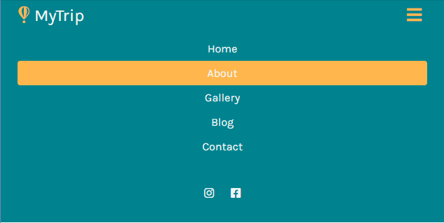

# Responsive Nav Bar
Responsive Navigation Bar with HTML CSS JavaScript

Followed open tutorial from Youtube [DreamCoding](https://www.youtube.com/watch?v=X91jsJyZofw, "youtube link")

## Wide Screen

## Small Screen

